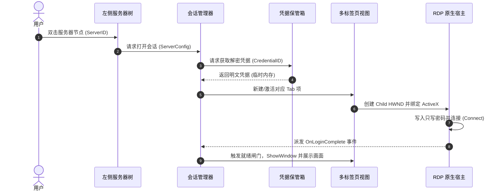

# RDPM (Remote Desktop Profile Manager) 系统架构与技术设计文档

## 1. 项目背景与目标

RDPM 是一款基于 **Rust + GPUI** 现代技术栈构建的 Windows 平台高性能 RDP 远程桌面连接与运维会话管理工具，旨在彻底替代老旧的 MultiDesk 等传统工具。

### 1.1 核心需求场景
- **启动 RDPM**：秒级冷启动，现代扁平化与深色/浅色主题支持，高 DPI 无损渲染。
- **左侧服务器树**：支持多层级分组、服务器元数据管理、快速拼音/IP模糊检索、快捷右键菜单。
- **双击连接**：双击服务器节点或通过快捷键发起 RDP 连接。
- **自动打开 RDP**：通过微软官方系统级 ActiveX 控件直连，原汁原味原生体验。
- **多个服务器 Tab**：支持单窗口内多会话 Tab 标签页切换，无缝隐藏与显现，杜绝窗口混乱。
- **断线自动重连**：网络抖动或远端会话短暂断开时自动执行指数退避重连，状态实时可视化。
- **Workspace（工作区）保存**：支持一键将当前打开的所有服务器 Tab、活动索引保存为工作区快照。
- **一键恢复整个运维环境**：下次启动 RDPM 或切换工作区时，通过队列平滑并发拉起所有远程桌面，秒级复原运维现场。

---

## 2. 参考 Navop 技术的深度选型分析

通过对开源项目 [feigeCode/navop](https://github.com/feigeCode/navop) 的深度剖析，确定本项目的核心技术路线：

### 2.1 为什么采用 C++/ATL 宿主 ActiveX 而非外部 mstsc.exe
| 方案 | 原理 | 优势 | 缺陷 | 结论 |
| :--- | :--- | :--- | :--- | :--- |
| **外部进程 SetParent 挂接** | 启动外部 `mstsc.exe`，Win32 查找 HWND 并重置父窗口 | 实现简单 | 消息循环冲突、焦点丢失、DPI 模糊、全屏/弹窗失控 | ❌ 坚决弃用 |
| **纯 Rust 软解 (IronRDP)** | 协议纯 Rust 解析 + GPUI Canvas 绘制 | 跨平台可移植 | 协议覆盖率有限、Windows 特性（NLA、音视频硬解、智能卡）兼容复杂 | ⚠️ 作为后续跨平台储备 |
| **C++/ATL 宿主 `mstscax.dll`** | 在 GPUI Win32 Child HWND 中内嵌 `MsRdpClient12` | 原生微软驱动级加速、完美的 NLA/凭据/剪贴板支持、无内存拷贝渲染 | 需要 C++ Shim 和 COM 事件代理 | ✅ **本工程采用方案** |

### 2.2 GPUI 与 Native HWND 的“空气空间 (Airspace)”与多 Tab 协同机制
GPUI 是基于 GPU（Direct3D 12/Direct3D 11）直接绘制界面的现代 UI 框架，而 Win32 Child HWND 属于 Windows DWM 独立合成物。二者协同的核心规则如下：
1. **几何位置实时同步**：在 GPUI 每一帧布局（Layout）后，获取 Tab 内容区的实际屏幕物理像素边界（结合 Window Scale Factor 缩放系数），调用 Win32 `SetWindowPos` 更新 Child HWND。
2. **防重复布局导致的鼠标抖动（Anti-Jitter）**：对比最新 Bounds 与当前已应用的 Bounds，若数值无变动则跳过 `SetWindowPos`，防止 `mstscax` 频繁重排。
3. **就绪闸门机制（Readiness Gate）**：创建 Child HWND 初始设为隐藏（零大小），等待收到 `OnLoginComplete` 事件且画面帧就绪后再调用 `ShowWindow(SW_SHOW)`，避免白屏闪烁。
4. **Tab 切换的焦点与可见性托管**：
   - 切换离开（Deactivate）：调用 `ShowWindow(SW_HIDE)`，并将键盘焦点主动移交还给 GPUI Parent 窗口；
   - 切换进入（Activate）：调用 `ShowWindow(SW_SHOW)`，并将焦点设置给 Native RDP 内部绘制窗口。

---

## 3. 总体系统架构设计

```text
+-----------------------------------------------------------------------+
|                             RDPM 主界面                                |
| +-------------------+-----------------------------------------------+ |
| |   顶部工具栏      | 标签栏: [Web-01] [DB-Master] [Redis-Cache] [+]  | |
| +-------------------+-----------------------------------------------+ |
| | 左侧服务器树      |                                               | |
| | [搜索/过滤框    ] |           当前激活的 RDP 会话视图               | |
| | v 生产服务器集群  |     (底层为贴合的 Win32 Child HWND + ActiveX)  | |
| |   - Web-Node-01   |                                               | |
| |   - Web-Node-02   |                                               | |
| | v 核心数据库集群  |                                               | |
| |   - DB-Master     |                                               | |
| |   - DB-Slave      |                                               | |
| +-------------------+-----------------------------------------------+ |
| | 底部状态栏: 当前工作区: [核心运维环境] | 延迟: 18ms | 状态: 正常       | |
+-----------------------------------------------------------------------+
```

### 3.1 模块职责分工

```text
rdpm/
├── crates/
│   ├── rdpm_core/           # 核心领域实体（服务器配置、分组、Workspace模型、配置存储）
│   ├── rdpm_vault/          # 凭据安全保管箱（Windows DPAPI 强加密）
│   ├── rdpm_rdp_host/       # C++/ATL Shim 静态库封装与 Rust FFI 抽象
│   ├── rdpm_session/        # RDP 会话状态机、心跳探测、断线退避自动重连调度器
│   ├── rdpm_workspace/      # 工作区快照序列化与阶梯式并发复原引擎
│   └── rdpm_ui/             # GPUI 视图：服务器树、多标签 Tab 容器、设置窗口
└── src/
    └── main.rs              # 应用程序启动入口与 GPUI App 初始化
```

---

## 4. 关键流程详细设计

### 4.1 双击连接与 Tab 创建流程


### 4.2 断线监测与自动重连算法
1. **事件捕获**：Native Host 监听 COM 接口 `OnDisconnected(reason_code)`。
2. **原因区分**：
   - 用户主动断开（点击关闭 Tab 或断开按钮）：直接触发清理与销毁；
   - 异常断开（网络波动、连接超时、远端临时重启）：进入自动重连状态机。
3. **退避算法**：
   - 初始延迟 1s，随后按 2s、4s、8s、15s 指数递增，最大重试次数默认为 5 次；
   - Tab 标签显示旋转重连指示器与“重连中 (第 N 次)”，状态栏显示实时进度；
   - 提供快捷操作：“立即重试”与“取消重连”。

### 4.3 Workspace 保存与一键恢复
1. **数据持久化模型**：
   ```json
   {
     "workspace_name": "核心运维日常",
     "active_session_index": 0,
     "sessions": [
       { "server_id": "srv_web_01", "custom_title": "Web-01" },
       { "server_id": "srv_db_master", "custom_title": "DB-Master" }
     ],
     "saved_at": 1727161200
   }
   ```
2. **阶梯式并发复原调度（Staggered Connection Queue）**：
   - 当启动恢复工作区时，若同时发起 10+ 个 RDP 握手，会导致网络瞬时拥塞甚至触发服务端防暴破限制；
   - **调度策略**：
     - 优先立即连接上一次激活的当前 Tab（高优先级，使用户最快进入工作状态）；
     - 将其余 Tab 放入后台连接队列，按照每 250ms~300ms 间隔平滑拉起一个连接；
     - 任意会话失败不阻塞后续会话的建立。

---

## 5. 便携绿色版设计与数据存储规范

本项目严格定位于**纯绿色便携软件（Portable Edition）**：
1. **零安装、零污染**：
   - 不向系统 `Program Files` 安装任何文件；
   - 不向 Windows 注册表写入开机项或软件配置；
   - 严格禁止向系统 `%APPDATA%` 或 `%LOCALAPPDATA%` 写入业务数据。
2. **所有数据存放于 exe 同级目录**：
   - 通过 `std::env::current_exe()` 动态获取当前可执行文件所在真实物理路径；
   - 所有运行时数据、服务器节点配置、工作区快照及加密凭据统一存放于 `exe` 同目录下的 `data/` 目录中：
     ```text
     rdpm/
     ├── rdpm.exe                     # 绿色版单可执行程序
     └── data/                        # 所有数据存放于此（可整体备份/迁移）
         ├── settings.json            # 应用程序全局设置
         ├── servers.json             # 服务器树与分组配置
         ├── workspaces.json          # 保存的工作区快照
         ├── credentials.enc          # 加密后的凭据保险箱数据
         └── logs/                    # 运行日志（自动轮转）
     ```
3. **安全凭据便携机制**：
   - 默认采用 Windows 原生 DPAPI 绑定当前系统用户进行透明强加密；
   - 在同台电脑任意磁盘、文件夹移动时即插即用、无缝免密登录；
   - 跨电脑拷贝时若 DPAPI 无法解密，自动给出“环境已迁移，请重新输入凭据”的温和提示，保障安全与便携的平衡。
4. **内存即刻清零**：在向 ActiveX 控件写入只写属性 `ClearTextPassword` 后，立即使用 `zeroize` 覆写内存缓冲区。

