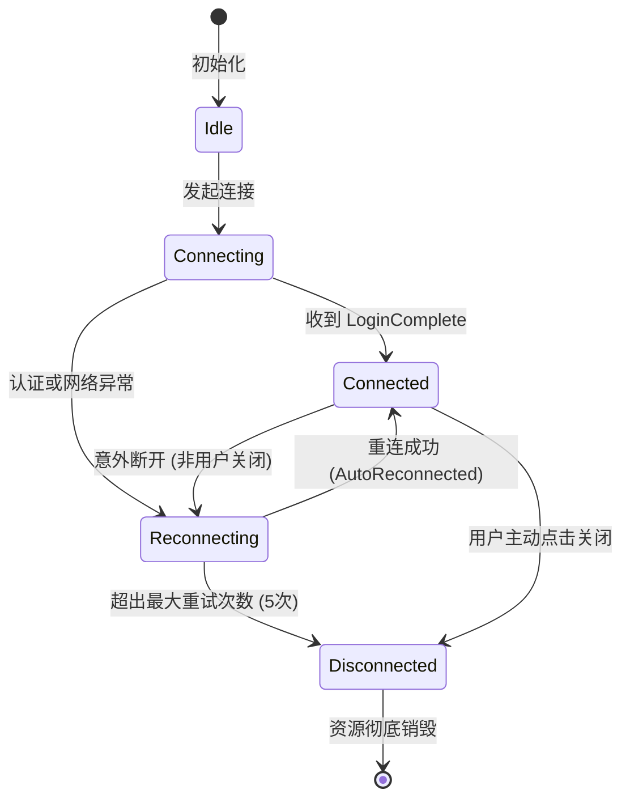
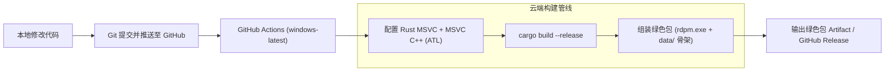

# RDPM (Remote Desktop Profile Manager) 详细设计说明书

## 1. 系统模块架构与工程全景

RDPM 采用多 Crate 的 Workspace 架构，实现业务逻辑、界面展现、底层 C++/ActiveX 宿主及凭据安全的彻底解耦：

```text
rdpm/
├── Cargo.toml                          # Workspace 根配置文件
├── docs/                               # 项目设计与规范文档
│   ├── design.md                       # 概要架构设计
│   ├── detailed-design.md              # 详细设计说明书（本文档）
│   ├── implementation-plan.md          # 实施任务清单
│   └── phases.md                       # 阶段里程碑与交付标准
├── crates/
│   ├── rdpm_core/                      # 基础领域模型、序列化、配置管理
│   │   ├── src/
│   │   │   ├── lib.rs
│   │   │   ├── model/                  # 服务器树、分组、节点
│   │   │   ├── config/                 # 应用程序配置与持久化
│   │   │   └── rdp_options/            # 分辨率、剪贴板、音频等连接选项
│   ├── rdpm_vault/                     # 凭据安全保管箱（Windows DPAPI 强加密）
│   │   ├── src/
│   │   │   ├── lib.rs
│   │   │   ├── dpapi.rs                # CryptProtectData / CryptUnprotectData
│   │   │   └── memory.rs               # 密码零化（Zeroize）内存守护
│   ├── rdpm_rdp_host/                  # Windows 原生 RDP 宿主模块（C++/ATL Shim）
│   │   ├── build.rs                    # MSVC C++ 静态库编译脚本
│   │   ├── native/                     # C++ 底层代码
│   │   │   ├── host.h                  # C ABI 头文件定义
│   │   │   ├── active_x_host.cpp       # AtlAxWin 初始化与窗口承载
│   │   │   └── event_sink.cpp          # DMsRdpClientEvents COM 事件代理
│   │   └── src/                        # Rust FFI 与安全包装
│   │       ├── lib.rs
│   │       ├── ffi.rs                  # 外部函数声明与 C 结构体
│   │       ├── handle.rs               # 宿主不透明指针安全句柄
│   │       └── events.rs               # Rust 强类型事件流
│   ├── rdpm_session/                   # 会话状态机、断线退避重连、心跳调度
│   │   ├── src/
│   │   │   ├── lib.rs
│   │   │   ├── state.rs                # 会话状态机定义
│   │   │   ├── reconnect.rs            # 指数退避重连算法
│   │   │   └── manager.rs              # 多会话生命周期统筹
│   ├── rdpm_workspace/                 # 工作区快照序列化与阶梯并发恢复
│   │   ├── src/
│   │   │   ├── lib.rs
│   │   │   ├── snapshot.rs             # 会话快照结构
│   │   │   └── staggered_queue.rs      # 阶梯式平滑连接队列调度
│   └── rdpm_ui/                        # GPUI 视图呈现与交互层
│       ├── src/
│       │   ├── lib.rs
│       │   ├── app_window.rs           # 主窗口布局
│       │   ├── sidebar/                # 左侧服务器树与搜索框
│       │   ├── tab/                    # 多 Tab 容器与 Airspace 几何贴合
│       │   ├── status_bar.rs           # 底部状态栏
│       │   └── dialog/                 # 新建/编辑服务器与设置对话框
└── src/
    └── main.rs                         # 应用程序入口点
```

---

## 2. 核心子系统详细设计

### 2.1 Windows Native RDP 宿主模块 (`rdpm_rdp_host`)

本模块是软件能够媲美原版 MultiDesk 体验的基石。

#### 2.1.1 C ABI 接口契约 (`host.h`)
```c
#pragma once
#include <stdint.h>
#include <windows.h>

#ifdef __cplusplus
extern "C" {
#endif

// 句柄类型定义
typedef struct RdpmNativeHost RdpmNativeHost;

// 事件类型枚举
typedef enum {
    RDPM_EVENT_CONNECTING = 1,
    RDPM_EVENT_CONNECTED = 2,
    RDPM_EVENT_LOGIN_COMPLETE = 3,
    RDPM_EVENT_DISCONNECTED = 4,
    RDPM_EVENT_AUTO_RECONNECTING = 5,
    RDPM_EVENT_AUTO_RECONNECTED = 6,
    RDPM_EVENT_FATAL_ERROR = 7
} RdpmEventType;

// 事件回调函数原型
typedef void (*RdpmEventCallback)(
    void* user_data,
    RdpmEventType event_type,
    int32_t reason_or_error,
    const wchar_t* description
);

// 连接参数配置
typedef struct {
    const wchar_t* host;
    uint32_t port;
    const wchar_t* username;
    const wchar_t* domain;
    const wchar_t* password;
    uint32_t desktop_width;
    uint32_t desktop_height;
    uint32_t smart_sizing;
    uint32_t audio_mode;         // 0: 本地播放, 1: 远端播放, 2: 禁用
    uint32_t redirect_clipboard; // 0: 禁用, 1: 启用
    uint32_t redirect_drives;    // 0: 禁用, 1: 启用
} RdpmConnectParams;

// 生命周期管理 API
RdpmNativeHost* rdpm_host_create(HWND parent_hwnd, RdpmEventCallback cb, void* user_data);
int32_t rdpm_host_connect(RdpmNativeHost* host, const RdpmConnectParams* params);
int32_t rdpm_host_disconnect(RdpmNativeHost* host);
void rdpm_host_destroy(RdpmNativeHost* host);

// 窗口几何与焦点控制 API
void rdpm_host_set_bounds(RdpmNativeHost* host, int32_t x, int32_t y, int32_t width, int32_t height);
void rdpm_host_set_visible(RdpmNativeHost* host, int32_t visible);
void rdpm_host_set_focus(RdpmNativeHost* host);
void rdpm_host_update_display(RdpmNativeHost* host, uint32_t width, uint32_t height);

#ifdef __cplusplus
}
#endif
```

#### 2.1.2 ATL AxWin 宿主机制 (`active_x_host.cpp`)
1. **容器初始化**：进程启动阶段通过 `AtlAxWinInit()` 注册 `AtlAxWin` 窗口类。
2. **子窗口创建**：
   ```cpp
   m_hwnd = CreateWindowExW(
       0,
       L"AtlAxWin",
       L"MsTscAx.MsTscAx", // 或 CLSID_MsRdpClient12
       WS_CHILD | WS_CLIPCHILDREN | WS_CLIPSIBLINGS,
       0, 0, 0, 0,
       parent_hwnd,
       NULL,
       GetModuleHandle(NULL),
       NULL
   );
   ```
3. **接口查询与配置**：
   - 通过 `AtlAxGetControl(m_hwnd, &pUnknown)` 获取 IUnknown；
   - QueryInterface 获得 `IMsRdpClient10` 核心接口；
   - QueryInterface 获得 `IMsRdpClientNonScriptable5`，调用 `put_ClearTextPassword((BSTR)password)` 安全写入密码（内存立清）；
   - 获取 `AdvancedSettings9`，配置 NLA 认证模式、网络超时重连参数。

#### 2.1.3 COM 事件接收器代理 (`event_sink.cpp`)
- 继承 `IDispatch` 实现连接点挂载：`AtlAdvise(m_client, this, DIID_DMsRdpClientEvents, &m_cookie)`；
- 在 `Invoke(DISPID dispIdMember, ...)` 中拦截核心事件并转译触发 Rust 的 `RdpmEventCallback`。

---

### 2.2 GPUI 与 Native 子窗口多 Tab 融合机制 (`rdpm_ui`)

#### 2.2.1 物理坐标转换与几何对齐
GPUI 使用逻辑像素（`Pixels`），而 Win32 API `SetWindowPos` 使用物理屏幕像素（`i32`）：
$$\text{PhysicalX} = \text{round}\big((\text{LogicalOriginX} - \text{ParentClientOriginX}) \times \text{ScaleFactor}\big)$$
$$\text{PhysicalWidth} = \text{round}\big(\text{LogicalWidth} \times \text{ScaleFactor}\big)$$

#### 2.2.2 防光标抖动（Anti-Jitter）算法
```rust
pub fn update_bounds(&mut self, new_bounds: Win32PhysicalBounds) {
    // 只有当坐标或宽高真正发生改变时才更新，防止每帧重复下发 SetWindowPos 导致远端重排抖动
    if self.applied_bounds == Some(new_bounds) {
        return;
    }
    self.applied_bounds = Some(new_bounds);
    unsafe {
        rdpm_host_set_bounds(
            self.raw_handle,
            new_bounds.x,
            new_bounds.y,
            new_bounds.width,
            new_bounds.height,
        );
    }
}
```

#### 2.2.3 多 Tab 切换与 Airspace 遮挡控制
- **失活（Deactivate）**：
  1. 调用 `rdpm_host_set_visible(handle, 0)`（底层调用 `ShowWindow(SW_HIDE)`）；
  2. 调用 `SetFocus(parent_hwnd)`，将键盘焦点移交给 GPUI 主窗口，防止全局快捷键被截获。
- **激活（Activate）**：
  1. 调用 `rdpm_host_set_visible(handle, 1)`（底层调用 `ShowWindow(SW_SHOW)`）；
  2. 调用 `rdpm_host_set_focus(handle)`。
- **就绪闸门（Readiness Gate）**：
  新建立连接时，子窗口在收到 `RDPM_EVENT_LOGIN_COMPLETE` 之前保持大小为 0 或隐藏，避免出现灰白闪烁。
- **弹窗避让策略**：
  当用户呼出主菜单、新建连接对话框时，临时向激活的 Child HWND 发送 `SW_HIDE`，弹窗关闭后重新 `SW_SHOW`，杜绝 Win32 控件穿透置顶盖住 GPUI 弹窗。

---

### 2.3 左侧服务器树与快速检索 (`rdpm_core` + `rdpm_ui`)

#### 2.3.1 树形数据结构定义
```rust
#[derive(Debug, Clone, Serialize, Deserialize)]
pub struct ServerTree {
    pub root_groups: Vec<ServerGroup>,
}

#[derive(Debug, Clone, Serialize, Deserialize)]
pub struct ServerGroup {
    pub id: String,
    pub name: String,
    pub is_expanded: bool,
    pub subgroups: Vec<ServerGroup>,
    pub servers: Vec<ServerEntry>,
}

#[derive(Debug, Clone, Serialize, Deserialize)]
pub struct ServerEntry {
    pub id: String,
    pub name: String,
    pub host: String,
    pub port: u16,
    pub username: String,
    pub domain: Option<String>,
    pub credential_id: Option<String>, // 引用凭据保管箱中的凭据
    pub options: RdpOptions,
}
```

#### 2.3.2 拼音全拼与首字母模糊搜索
- 支持使用全拼（如 `beijing`）或拼音首字母（如 `bj`）匹配“北京服务器”；
- 支持 IP 段包含匹配（如 `192.168.1`）。

---

### 2.4 凭据安全保管箱 (`rdpm_vault`)

#### 2.4.1 Windows DPAPI 加密流程
```rust
// 伪代码实现说明
pub fn encrypt_secret(plain_text: &[u8]) -> Result<Vec<u8>, VaultError> {
    let mut input_blob = DATA_BLOB {
        cbData: plain_text.len() as u32,
        pbData: plain_text.as_ptr() as *mut u8,
    };
    let mut output_blob = DATA_BLOB { cbData: 0, pbData: std::ptr::null_mut() };
    
    // 使用当前登录用户的 Windows 凭据作为保护密钥
    let success = unsafe {
        CryptProtectData(
            &mut input_blob,
            std::ptr::null(), // 描述信息
            std::ptr::null_mut(), // 额外熵（可选）
            std::ptr::null_mut(),
            std::ptr::null_mut(),
            CRYPTPROTECT_UI_FORBIDDEN, // 禁止弹出系统提示
            &mut output_blob,
        )
    };
    // 拷贝密文并释放 LocalFree，明文内存通过 zeroize 清除
    ...
}
```
- **便携数据目录规范**：
  所有数据存放于当前 `rdpm.exe` 所在目录下的 `data/` 目录中（路径为 `<exe_dir>/data/credentials.enc`），不写系统 AppData 也不写注册表。
- **内存安全擦除**：所有解密出来的临时密码结构体均实现 `Zeroize` 和 `Drop`，离开作用域立即覆写抹除内存。
- **跨机器移动容错**：由于 DPAPI 与 Windows 用户密钥绑定，当用户将整个文件夹拷贝到其他机器使用时，若解密失败，系统不报错闪退，而是安全置空并引导用户重新输入凭据。


---

### 2.5 断线自动重连与状态机 (`rdpm_session`)

#### 2.5.1 会话状态转移图


#### 2.5.2 指数退避算法与调度器
- 重试间隔：$T(n) = \min(2^{n-1} \times 1000\text{ms}, 16000\text{ms})$，即 1s、2s、4s、8s、16s；
- 每次重试附带唯一的 `generation_id`，防止上一轮因延迟到达的事件干扰最新一轮重连。


---

### 2.6 工作区（Workspace）与阶梯平滑恢复 (`rdpm_workspace`)

#### 2.6.1 数据模型
```json
{
  "active_workspace_id": "ws_daily_ops",
  "workspaces": [
    {
      "id": "ws_daily_ops",
      "name": "日常运维",
      "active_tab_index": 1,
      "tabs": [
        { "server_id": "srv_web_01", "pinned": true },
        { "server_id": "srv_db_master", "pinned": false },
        { "server_id": "srv_k8s_node01", "pinned": false }
      ]
    }
  ]
}
```

#### 2.6.2 阶梯并发恢复调度器（Staggered Concurrency Scheduler）
当恢复包含 10 个服务器的工作区时，调度器执行两段式启动：
1. **立即拉起活跃 Tab**：索引为 `active_tab_index` 的会话以高优先级立即创建 HWND 并握手；
2. **延迟队列拉起其余 Tab**：其余 9 个会话压入 FIFO 队列，由 Tokio 异步任务每隔 250ms 取出一个发起连接，既防止瞬时 CPU/网络拥塞，又确保在数秒内全套环境自动就绪。

---

## 3. GitHub Actions 云端自动化构建与发布设计

针对本地无 Rust/MSVC 编译环境的场景，工程设计了完备的 GitHub Actions CI/CD 工作流：



### 3.1 云端环境要求
- **Runner 镜像**：`windows-latest`（默认自带 Visual Studio 2022、MSVC C++、ATL/MFC 组件、Windows SDK 10/11）。
- **Rust 工具链**：`stable-x86_64-pc-windows-msvc`。
- **打包格式**：
  - `rdpm-portable-windows-x64.zip`：内含 `rdpm.exe` 和预创建的 `data/` 目录；
  - 发布 Release 时自动关联此 Zip 包，用户下载解压双击即可使用。

